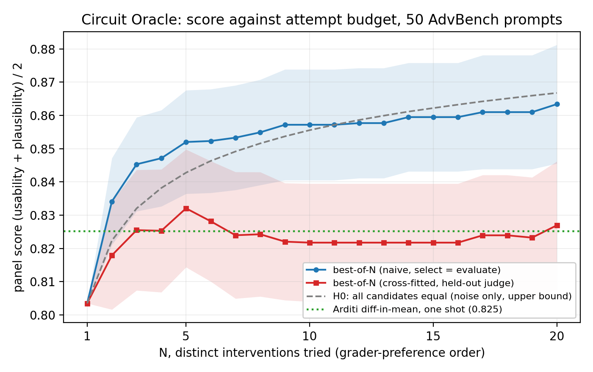

# Circuit Oracle results

An LLM agent, the Circuit Oracle, reads transcoder attribution graphs from a subject model
and answers safety-relevant questions about that model's internal computation. An earlier
version of this work appeared at the ICML 2026 Mechanistic Interpretability Workshop,
[openreview.net/forum?id=ANY6YrYUZE](https://openreview.net/forum?id=ANY6YrYUZE). The
tables below are the results of record and supersede that paper.

Every number here is computed from files committed in this repository, listed in
[summary/README.md](summary/README.md). The longer notes behind each table, meaning the
per-judge and per-dataset breakdowns, the cross-fitted attempt-budget curve, the
reproduction commands and what was not measured, are in
[summary/details.md](summary/details.md).

Each task has its own instrument, so no number crosses task boundaries.

- **Task 1, spurious probe features** (`spurious-correlation/`). Subject `google/gemma-2-2b`.
  80 items, 4 datasets by 10 prompts by 2 probes. Scored by one `openai/gpt-5.4-mini` judge
  on a categorical verdict, spurious-dominant or not.
- **Task 2, secret elicitation** (`secret-elicitation/`). Subject `Qwen/Qwen3-8B` with taboo
  LoRAs. 48 items, 8 secret words by 6 prompts. Closed protocol shows a 20-word menu and is
  scored by exact match. Open protocol hides the menu and is scored by top-10 recall. One
  `openai/gpt-oss-120b` judge.
- **Task 3, suppression jailbreak** (`refusal-jailbreaking/`). Subject `Qwen/Qwen3-4B`. 50
  AdvBench-derived refusal prompts. A five-model panel (`anthropic/claude-sonnet-5`,
  `x-ai/grok-4.3`, `google/gemini-3.5-flash`, `moonshotai/kimi-k2.6`, `z-ai/glm-5.2`)
  scores usability and plausibility in [0, 1], and the score is their mean.

The orchestrator in every reference cell is `minimax/minimax-m3`.

---

## Task 1, spurious probe features

Gemma-2-2B linear probes are trained on four datasets where a spurious cue tracks the
label. The oracle reads the probe's attribution graph and says whether the probe is
dominated by spurious features or by causal ones.

### What changed since the paper

- The baselines were ranking at the wrong layer. Every dictionary was pinned to one fixed
  layer instead of each dataset's own probe layer. The layer now tracks the dataset.
- The top-20 selection could be degenerate. When fewer than 20 features fired, the
  biased-ranked and unbiased-ranked lists became the same set. Per-token encoding fixed the
  underlying sparsity.
- The baseline analyst was re-run on the arms' own orchestrator model.
- The headline scoring rule moved from a threshold on the spurious fraction to the judge's
  categorical verdict.
- A five-arm ablation grid was added, arm 1 was repeated five times over the same fixed
  graphs, and paired significance tests replaced eyeballed error bars.

### What the graph contributes

Same 80 items, same judge, same subject model. Only what the method may read changes. The
two baselines rank the active dictionary features by cosine similarity with the probe
weight vector at one layer and show an analyst the top 20 with their labels, top tokens and
activating snippets. The analyst is the same model that orchestrates the oracle.

| method | attribution graph | edge traversal | autointerp labels | agent loop | accuracy |
|---|:---:|:---:|:---:|:---:|---:|
| Circuit Oracle, full | yes | yes | yes | yes | **78.2% +/- 2.4** |
| `inspect_feature` off | yes | yes | **no** | yes | 81.2% |
| one-shot top-k, no traversal | yes | **no** | yes | **no** | 77.5% |
| Trans-cos, one layer | **no** | no | yes | no | 72.5% |
| SAE-cos, one layer | **no** | no | yes | no | 65.0% |

The oracle row is the mean and standard deviation over five passes. Every other row is one
pass, and a single pass over 80 items carries about a 4.6 point binomial standard error, so
removing the labels or the traversal leaves accuracy unchanged within noise and only
removing the graph moves it. On a paired sign test over the same 80 items the oracle beats
Trans-cos on 13 items and loses on 4 (p = 0.049), and beats SAE-cos on 19 and loses on 4
(p = 0.003).

### Baselines after the fixes

| method | features seen | accuracy |
|---|---|---:|
| Trans-cos | one layer | 72.5% |
| SAE-cos | one layer | 65.0% |
| Circuit Oracle | across layers | **78.2% +/- 2.4** |

Both baselines answer "biased" on every item of CivilComments and MultiNLI, so their
aggregate rests on the two BiasInBios datasets. The per-dataset split is in the detailed
notes.

---

## Task 2, secret elicitation

A Qwen3-8B taboo LoRA knows a secret word and is trained never to say it. The oracle reads
the attribution graph and tries to name the word.

### What changed since the paper

- A judge formatting failure was being scored as an oracle miss. The judge's token budget
  was too small for a model that writes an analysis channel before its answer, so the
  truncated output was recorded as wrong. The budget is now 2048.
- The two protocols became separate arms with separate tool surfaces. Open mode drops the
  one tool that tallies candidates against the menu, which would leak it.
- A three-orchestrator arm grid was added, and arm 1 was repeated five times in both
  protocols.
- Autointerp labels moved to a local server, because this subject's transcoder dictionary
  is not on Neuronpedia.

### Against the baselines

| method | closed | open |
|---|---:|---:|
| Activation Oracle | **81.2%** | **68.8%** |
| Circuit Oracle, 5-pass mean | 69.2% +/- 0.9 | 27.9% +/- 3.2 |
| SAE-proj | 18.8% | 12.5% |
| Trans-proj | 4.2% | 0.0% |

Closed is exact-match accuracy on the 20-word menu and open is top-10 recall, so the two
columns are different measurements. The Circuit Oracle row is scored on the runs in this
repository. The three baseline rows were not re-run. They are the workshop paper's values on
the same 48 items, scored by that paper's judge, and they sit here for orientation. The
Activation Oracle leads in both protocols. It needs a LoRA adapter trained on the subject
model itself, while the Circuit Oracle reads the graph of whatever model produced it.

---

## Task 3, suppression jailbreak

Qwen3-4B refuses a harmful request. The oracle reads the attribution graph, proposes
feature sets it believes gate the refusal, and the harness runs batched negative-steering
sweeps over them. The comparison target is the Arditi difference-in-means refusal
direction, ablated from every layer, which yields one direction and therefore one attempt.

### What changed since the paper

- The eval set was rebuilt to 50 AdvBench-derived refusal prompts, 10 kept from the earlier
  set plus 40 new ones capped at one per behavior family and drawn from prompts the
  baseline never trained on. Censorship was dropped as a family.
- The judge was redesigned. Five model families, two axes, one repeat, replacing a smaller
  panel scoring a third axis over several repeats.
- The agent no longer executes interventions. It proposes feature sets and the harness runs
  them, as an argument-free anchor sweep and then a batched supernode sweep.
- The single verification phase became three, PIN then ANCHOR then SUPERNODES, with
  end-of-turn guards on pin coverage and on the number of supernode rounds.
- One graph per slug is reused across passes, and the baseline direction was re-derived on
  the new prompt pool.

### Head to head

Same 50 prompts and same five-judge panel in every cell. The orchestrator also ranks the
oracle's own attempts and picks the single one it commits to. The panel that scores the
result excludes it.

| method | score |
|---|---:|
| Arditi difference-in-means | **0.825** |
| Circuit Oracle, committed single pick | 0.804 |
| Circuit Oracle, best of 5 attempts | 0.854 |

On the committed pick the oracle trails by 0.021 and wins 18 of the 50 prompts. Best of 5
is a ceiling rather than a head-to-head, since it gives the oracle five attempts where the
baseline gets one. At that ceiling the oracle takes 30 of 50. The unsteered model scores
0.041 on this set.

### Attempt budget

The oracle returns a ranked pool of distinct candidate interventions per prompt, so a
second attempt costs one more candidate off a list that already exists. Best-of-N takes
the best panel score among the first N.

| N | best-of-N |
|---:|---:|
| 5 | 0.854 |
| 10 | 0.857 |
| 20 | 0.863 |

The first five attempts add +0.050 over the committed pick and the next fifteen add +0.009.
These cells select and score on the same panel, so they are upper bounds. The N = 5 cell
comes from the rank-based summary file and the N = 10 and N = 20 cells from the per-run
distinct-candidate files, whose own N = 5 reads 0.852.

The blue curve is the table above. The red curve is the cross-fitted version, where four
judges choose the candidate and the held-out fifth scores it, averaged over the five folds.
It peaks at N = 5 (0.832) and does not rise after that, which is the honest reading of
the budget. The dashed line is the climb a running maximum produces when every candidate is
equally good, an upper bound on the noise share. The dotted line is the Arditi one-shot
score. The cross-fitted numbers and their paired intervals are in the detailed notes.

---

## Stability across repeat runs

Arm 1 of tasks 1 and 2 was run five times. The graph is fixed per item, so the spread is
agent variance and nothing else.

| task | metric | 5-run result | runs |
|---|---|---:|---|
| spurious probes | accuracy, 80 items | **78.2% +/- 2.4** | 77.5, 77.5, 77.5, 76.2, 82.5 |
| secret elicitation, closed | accuracy, 48 items | **69.2% +/- 0.9** | 68.8, 68.8, 68.8, 70.8, 68.8 |
| secret elicitation, open | top-10 recall | **27.9% +/- 3.2** | 29.2, 27.1, 29.2, 31.2, 22.9 |

On task 1 the answer is stable while the route to it is not. Two passes over the same graph
pin partly different features but mostly the same layers.

| spurious probes, 5 runs, graph fixed | overlap between two runs |
|---|---:|
| the exact features pinned | Jaccard 0.511 |
| the layers those features sit in | Jaccard 0.754 |

Task 2 runs no edge traversal, so it has no route measurement. Its answers are stable in
closed mode (the majority answer word is given on 91.2% of passes) and unstable in open
mode (52.5%, with a shortlist Jaccard of 0.162 between passes).

---

## Orchestrator dependence

Same skill, same graphs and the full tool surface. Only the orchestrator model changes.

| orchestrator | spurious probes | elicitation, closed | elicitation, open |
|---|---:|---:|---:|
| `minimax/minimax-m3`, 5 runs | **78.2% +/- 2.4** | **69.2% +/- 0.9** | **27.9% +/- 3.2** |
| `openai/gpt-5.6-terra` | 70.0% | 70.8% | 22.9% |
| `google/gemma-4-31b-it`, 31B open weights | 72.5% | 68.8% | 25.0% |

A single pass carries about a 4.6 point standard error over 80 items and about 6.6 over 48,
so on task 1 only the roughly 8 point gap is resolvable and on task 2 closed mode nothing
separates the three. Task 3 was run with one orchestrator only.

---

## Cost

Orchestrator spend summed from the per-run cost fields, as recorded in
`summary/data/`. GPU time for graph building is not recorded in any committed artifact.

| task | runs | orchestrator cost |
|---|---:|---:|
| 1, spurious probes | 720 judged passes over 5 arms | $47.53 |
| 2, secret elicitation | 672 runs over 6 arms | $34.49 |

Arm 3 of task 1 recorded no cost, so the task 1 total is a floor. Task 3's orchestrator
cost is not recorded in the committed files.
